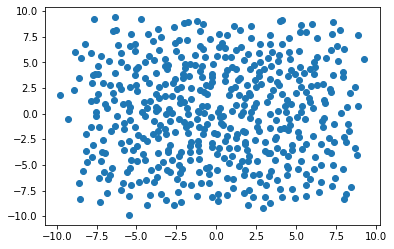

# Gauss-Hermite determinantal point processes

This library implements sampling from projection determinantal point processes with standard Gaussian base meaure on $\mathbb{R}^d$. That is,

$$x_1, x_2, \ldots, x_n \sim DPP(\mu_n, K_N)$$

with density $$\frac{1}{N!} \det(K_N(x_n, x_m))_{n,m=1}^N \mu^{\otimes N}(dx) $$

where $\mu$ is the standard Gaussian measure on $\mathbb{R}^d$ and 

$$K_N(x, x') = \sum_{k=0}^{N-1} \phi_k(x)\phi_k(x').$$

The method is adapted from the approach of [Gautier, Bardenet and Valko, 2019](https://hal.archives-ouvertes.fr/hal-02277739/document) and is detailed fully in [Baskerville, 2022](https://arxiv.org/pdf/2203.08061.pdf).


```python
import matplotlib.pyplot as plt

from hermitedpp import MultivariateHermiteFactorOPE
```


```python
mh = MultivariateHermiteFactorOPE(500, 2)
samples = mh.sample()
plt.scatter(*samples.T);
```


    

    


# Notebooks

1. Timing.ipynb contains experiments to investigate the performance (speed) of the DPP sampler.
2. Sampler development.ipynb contains exploritory work to develop the various hand-tuned samplers.
3. MC integration.ipynb contains experiments applying samples from DPP to MC integration.

# Development

A standard installation with pip will compile and install the Cython files automatically.

For development, you will probably want to run in a virtual environment and avoid installing the library. The Cython backend files will still need to be compiled and installed however. The `cythonsetup.py` script can be used to install just the cython modules: 

```python setupcython.py install```

Note that `hermitedpp/semi_circle_cython_backed.pyx` will be installed statically in your locally environment and will not automatically pick up changes made to that source file.
